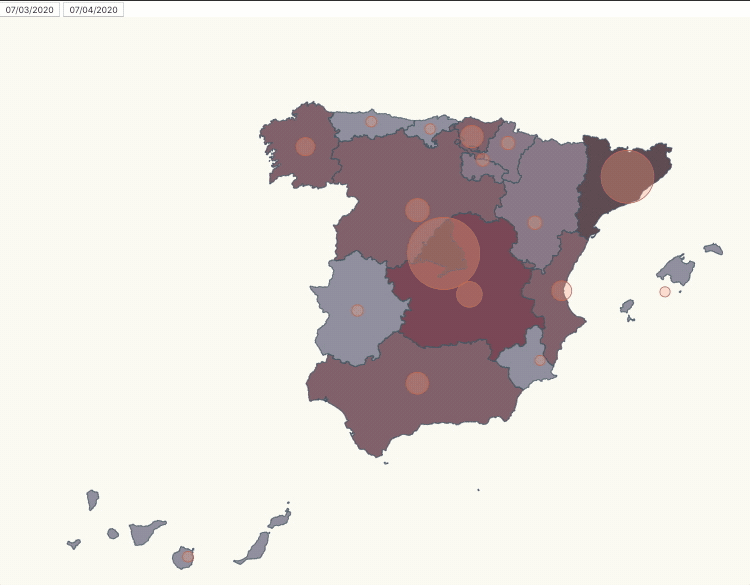

# d3js - ADVANCED TASK
# UPDATING BACKGROUND COLOR

In this task we want to add to our chart a background color as an indicator of the number of cases in every region also. 

We still want to have our buttons to change visualization between two dates.



Our departure point is the code we performance in the mandatory task (https://github.com/FernndMR/d3js-mandatory.git), based on the code of Lemoncode (https://github.com/Lemoncode/d3js-typescript-examples/tree/master/02-maps/02-pin-location-scale).

# Steps

- Clone the project from: https://github.com/FernndMR/d3js-mandatory.git
- Execute

```bash
npm install
```
```bash
npm start
```
- Remove fill atribute from map.css country, to be able to change the background.

_./src/map.css_

```typescript
.country {
  stroke-width: 1;
  stroke: #2f4858;
}
```

- Define a color gradient for the background, according to the number of cases we have in stats.

_./src/index.ts_
```typescript
  var color = d3
  .scaleThreshold<number, string>()
  .domain([5, 50, 100, 1000, 2500, 5000, 10000, 20000, 40000])
  .range([
    "#DEE4E4",
    "#C2C4C4",
    "#A7B0B3",
    "#929AA5",
    "#858394",
    "#7F6C7D",
    "#77555F",
    "#713D4C",
    "#564147"
  ]);
  ```

- Create a function to set the background color depending on the number of cases in the stats and draw the map. This part of code has to be inside ***updateCases*** function.

```typescript
  const assignBackgroundColor = (name: string) => {
    const item = data.find(
        item => item.name === name
    );
    if (item) {
      console.log(item.value);
    }
    return item ? color(item.value) : color(0);
  };
  
  svg
    .selectAll("path")
    .data(geojson["features"])
    .enter()
    .append("path")
    .attr("class", "country")
    .attr("fill", d => assignBackgroundColor(d["properties"]["NAME_1"]))
    .attr("d", geoPath as any)
    .merge(svg.selectAll("path") as any)
    .transition()
    .duration(500)
    .attr("fill", d => assignBackgroundColor(d["properties"]["NAME_1"]));
  ```
 ## Enjoy it!
